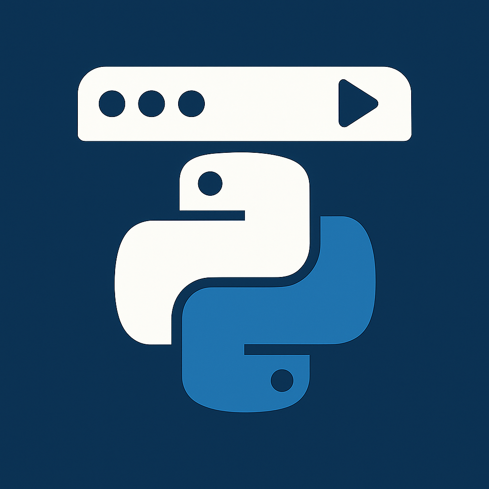

# MenuPy

Eine schlanke macOS-Menüleisten-App zum schnellen Ausführen von Python‑Skripten – ohne Terminal.



## Features
- Menüleisten‑App (LSUIElement): kein Dock‑Icon, immer griffbereit
- Python‑Skripte per Klick ausführen
- Ordner mit `.py`-Skripten oder einzelne Dateien hinzufügen
- Laufende Skripte anzeigen und beenden (einzeln oder alle)
- Interpreter wählen (Homebrew, pyenv, System, eigener Pfad); 3.12 wird bevorzugt, falls vorhanden
- Menüleisten‑Icon anpassen: eigene Bilddatei oder SF‑Symbol; Reset auf Standard
- Optionales Badge im Menüleisten‑Icon, das die Anzahl laufender Skripte zeigt (ein-/ausschaltbar)
- „Über MenuPy“-Dialog mit Icon, Version/Build und Link zur GitHub‑Repo

## Voraussetzungen
- macOS 13+
- Xcode (aktuell)
- [XcodeGen](https://github.com/yonaskolb/XcodeGen)

Installation XcodeGen (Homebrew):
```bash
brew install xcodegen
```

## Projekt generieren und starten
```bash
# Falls noch nicht geklont:
# git clone https://github.com/Anes-03/MenuPy.git
cd MenuPy
xcodegen generate
open MenuPy.xcodeproj
```
In Xcode das Scheme `MenuPy` auswählen und starten.

CLI‑Build (optional):
```bash
# Falls nötig Xcode als Developer Directory setzen
sudo xcode-select -s /Applications/Xcode.app/Contents/Developer

xcodebuild -project MenuPy.xcodeproj -scheme MenuPy -configuration Debug
```

## Nutzung
- Menüleistensymbol anklicken (Standard: SF‑Symbol „terminal“)
- Skripte ausführen: Skript im Menü wählen
- Laufende Skripte: unter „Laufende Skripte“ einzeln stoppen oder „Alle stoppen“
- „Aktualisieren“: Ordner neu einlesen, fehlende Dateien bereinigen
- „Über MenuPy“: Version/Build, Icon, Link zur GitHub‑Repo

## Einstellungen (⌘,)
Das Einstellungsfenster enthält:
- Vorschau des Menüleisten‑Icons
- Icon anpassen
  - „Bilddatei wählen…“: PNG/JPEG/TIFF/PDF als Icon verwenden
  - „SF‑Symbol setzen“: Auswahl aus einer kleinen Liste
  - „SF‑Symbolname“: freien SF‑Symbolnamen eintragen (z. B. `terminal`, `play.fill`, `gearshape`)
  - „Standard“: auf das Standard‑Icon zurücksetzen
- Badge
  - „Badge mit Anzahl laufender Skripte anzeigen“: Ein-/Ausschalten der Zahl neben dem Icon

## Python‑Interpreter
- Auto‑Erkennung typischer Pfade:
  - Homebrew: `/opt/homebrew/bin/python3`, `/opt/homebrew/bin/python3.12`, `…`, sowie `…/opt/python@3.12/bin/python3.12`
  - Intel‑Brew: `/usr/local/bin/python3`, `/usr/local/bin/python3.12`, `…`
  - System: `/usr/bin/python3`
  - pyenv: `~/.pyenv/versions/*/bin/python3` und `~/.pyenv/shims/python3`
- Menü „Python‑Interpreter“: erkannte Versionen wählen oder „Eigenen Interpreter wählen…“
- Fallback: `/usr/bin/env python3`, falls nichts gefunden wird

## Skripte verwalten
- „Skripte‑Ordner…“: gesamten Ordner mit `.py` laden (automatisch alle Dateien)
- „Skripte hinzufügen (.py)…“: einzelne Dateien aus beliebigen Orten
- „Hinzugefügte Skripte entfernen“: zuvor manuell hinzugefügte Dateien wieder löschen
- „Skripte‑Ordner entfernen“: den gesetzten Ordner zurücksetzen

## Tastaturkürzel
- Einstellungen: ⌘,
- Über MenuPy: ⌘I
- Beenden: ⌘Q
- Aktualisieren: r

## About‑Icon
- Asset‑Pfad: `Resources/Assets.xcassets/AboutIcon.imageset/AboutIcon.png`
- Alternativ‑Fallback: `Resources/AboutIcon.png`
- Falls ein Icon nicht angezeigt wird: Product → Clean Build Folder, erneut bauen

## Hinweise
- Die App beendet Skripte mit `SIGINT` (Interrupt), fällt auf `SIGTERM` und im Notfall `SIGKILL` zurück
- Ausführung erfolgt mit dem gewählten Interpreter im jeweiligen Skriptverzeichnis (`cwd`)
- Hardened Runtime ist aktiviert

## Fehlerbehebung
- XcodeGen fehlt: `brew install xcodegen`
- `xcodebuild` meckert über Command Line Tools: `sudo xcode-select -s /Applications/Xcode.app/Contents/Developer`
- About‑Icon erscheint nicht: Dateiname exakt `AboutIcon.png`; ggf. `Resources/AboutIcon.png` verwenden; Clean Build
- `python3` nicht gefunden: im Menü „Python‑Interpreter“ passenden Interpreter wählen oder Pfad manuell setzen

## Roadmap / Ideen
- Pro‑Skript Argumente/Umgebungsvariablen/Timeouts
- Per‑Skript Interpreter/venv
- Kategorien/Ordnerstruktur und Shortcuts je Skript

## Lizenz
Wähle eine Lizenz (z. B. MIT) und lege eine `LICENSE`‑Datei bei. Bis dahin gilt: Alle Rechte vorbehalten.

---
Made by Anes‑03
